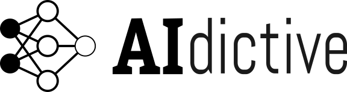

# AIdictive logo description

Hello! This is the AIdictive logo:

## Colors

* "dictive" is 90% gray.
* The rest of the logo is pure back and white.

## Neural net

9 mm each node. 1 mm edges and stroke of the hidden layer.
The output layer has an stroke of 0.5 mm.

## Fonts

* "AI": [Bitter][bitter]
* "dictive": [Abel][abel]

Size 80 and a vertical stretch from 20 to 25 mm.

[bitter]: https://fonts.google.com/specimen/Bitter
[abel]: https://fonts.google.com/specimen/Abel

